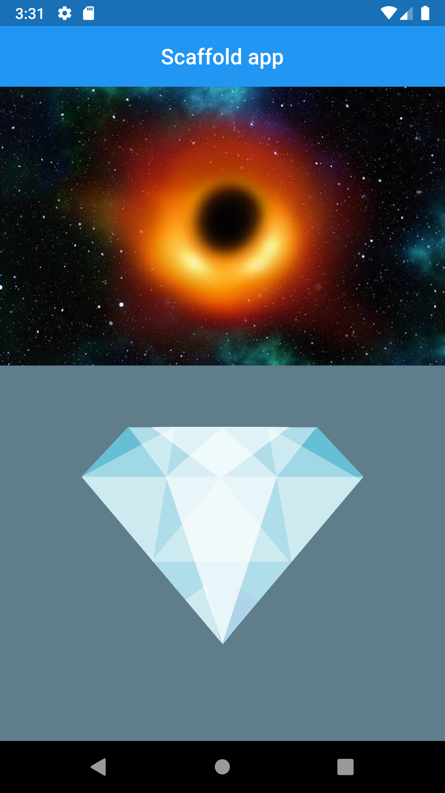

# scafold_app

Learning scafolds.

## Getting Started

This project demonstrate a scaffold app that contains two types of images: Asset and Network one.

The final result is shown below:

It demonstrate also how to change the app icon, this useful site called [appicon](https://appicon.co/)
help you to get all sizes for several devices including iOS and Android ones of course.

A few resources to get you started if this is your first Flutter project:

- [Lab: Write your first Flutter app](https://flutter.dev/docs/get-started/codelab)
- [Cookbook: Useful Flutter samples](https://flutter.dev/docs/cookbook)

For help getting started with Flutter, view our
[online documentation](https://flutter.dev/docs), which offers tutorials,
samples, guidance on mobile development, and a full API reference.
